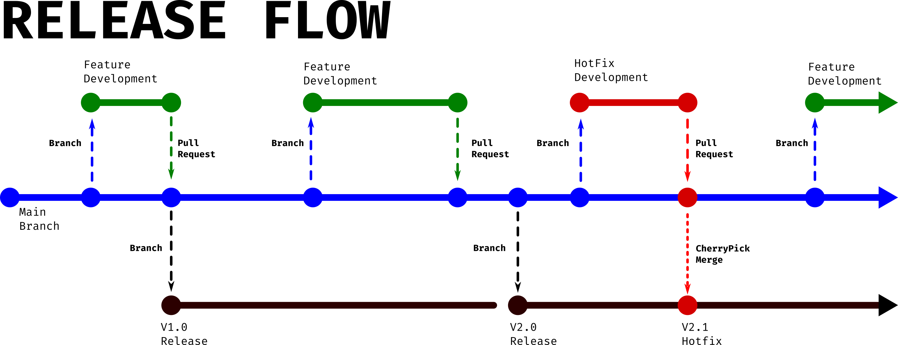

---
# *ACME Corporation is looking for devs with an understanding of Rails. The following set of questions relate to this RfQ-requirement.*---
---

### Q1 | Describe the architecture of a typical Rails application. (200-300)
Rails applications can be said to follow two architectural design patterns. These two design patterns are Monolithic application and MVC. A monolithic application as a oppose to a micro-services application is an app that is formed from one whole code base. It provides all of its functionality within itself. This differs form a micro-services style app where the app is formed by combining lots of little apps that work together to form a whole. While there is some debate on whether rails follows a true MVC pattern it is easy to say that it employs the principles of MVC heavily. MVC stands for Model, View, Controller; It is a pattern that splits up the large monolithic app into three related sub systems. The Model is responsible for manipulating the records within the applications database. This includes adding, editing or updating and removing them. The View takes information retrieved from the the model and renders it into a human accessible display. In rails this mainly takes the form of rendering the various web pages that are requested by a user. Finally the Controller is responsible for orchestrating the communication between the Model and the View. It is also the interface for the user. The user will request information, the Controller receives that request in the form of a route or HTTP request and then requests the information required from the model send it to the view to be rendered and then returns it to the user.
#### [Sources]---
1. [Advanced Ruby on Rails Architecture Way | Anastasiia Khmelovska](https://coaxsoft.com/blog/advanced-rails-architecture-way/)
2. [Episode #057 - Getting Started - Ruby on Rails - Architectural Overview | Driftiing Ruby](https://www.youtube.com/watch?v=9PAN-dvROl4)

### Q2 | Identify a database commonly used in web applications (including Rails) and discuss the pros and cons of this database (150-250)
###### PostgreSQL | Pros and Cons
When comparing the Pros and Cons of Postgres, it is useful to compare the database to other options out there. Postgres by default uses SQL to retrieve information from a relational database. A relational database is one with a strong schema meaning the data is organised into strict tables consisting of rows (the data entries) and columns (the types of information that makes up an entry) all information in a table will all be uniform. And more complicated information searches can be performed by "joining" related tables. This means that even if there is no information for a particular column for one row, the entry still has that column as part of its information. It makes it very easy to make sure that data retrieved from a relational database is going to match what your functions require as input. This differs from NoSQL databases or non relational databases. NoSQL databases forgo all the tables and forced uniformity of the data in favour of storing information information in collections of documents. These documents have a similar notation to that of a hash. The main difference here is that all documents are not forced to have the same keys. This leads to make a lot of operations performed on the database take less time as there are less checks and conventions to adhere to but means that you can't be certain of the properties being tracked by documents within a collection.
#### [Sources]---
1. [Comparison of PostgreSQL and MongoDB | Lorenz Stadler](https://www.youtube.com/watch?v=eM7hzKwvTq8)
2. [Pros and Cons of using PostgreSQL for Application Development | Stuti Dhruv](https://www.aalpha.net/blog/pros-and-cons-of-using-postgresql-for-application-development/)
3. [The Pros and Cons of 8 Popular Databases | Cody Arsenault](https://www.keycdn.com/blog/popular-databases#4-postgresql)

---
# *ACME Corporation is very big on project management, documentation and process. This will be a key metric in their decision to award the project. The following set of questions relate to this RfQ-requirement.*---
---

### Q3 | Discuss the implementation of Agile project management methodology (200-300)
Agile is just a project management style that helps to deliver products with changing end goals in a rapid and predictable pace. It achieves this by focusing on short term planing of achievable goals that bring the most value out of a given product. It is implemented by time boxing a (typically) two week period of time were a a development team will produce a working product that implements as many of the highest priority features as feasibly possible at the end of that period. The repeating that cycle with the next most important feature set again and again until the project is complete. It avoids the slowdowns of a traditional waterfall method by dedicating a core team of generalists that can work on many facets of the focused features at once. It also ensure the client gets exactly what they want even if what they want changes over the development cycle by closely involving the client, letting them determine what features bring the most value. Combining all this together results in a team that is more productive and delivers predictable value. This is because the people on the team are multi talented individuals that are all capable of working on any part of the project whilst producing a functional product every two weeks. Additionally as a client, you can see the product progress as you have a theoretically complete product every two and can decide to pivot or complete the project every short sprint.
#### [Sources]---
1. [Agile Foundations | Doug Rose](https://www.linkedin.com/learning/agile-foundations)
2. [Agile Project Management: Scrum & Sprint Demystified | Project Management Videos](https://www.youtube.com/watch?v=DvBKevrItcc)
3. [The Ultimate Guide to Implementing Agile Project Management (and Scrum) | Jory MacKay ](https://plan.io/blog/ultimate-guide-to-implementing-agile-project-management-and-scrum/)

### Q4 | Provide an overview and description of a standard source control workflow (100-200)
A source control flow is typically based around the release schedule of the software. One workflow that is popular is know as release workflow. This git work pattern is a trunk based git work flow. This means that branches that are created from the main branch are as short lived as possible before being merged back to main. This means that any amount of devs can branch out and develop code as need and cause less conflict on merge. When it comes time for a new release a branch is created from main and left as is, that code is used as the release. When the next release comes out the old release branch is discarded and a new one is created that is a copy of the main branch in its state at release. This doesn't make much sense, discarding the previous branch. what's the point? The final part of release flow is how hotfixes are handled. if there is a priority one bug found on the latest release, the fix for the bug is developed as a branch on main. when the fix is ready and merged back to main, that pull request is also then cherry picked for just the code that provides the fix and then merged to the current release. The benefit of this little bit of extra effort is that it ensures all bugs are fixed on main first meaning that those bugs won't appear again in the next release. if it were just worked on as a branch of the current release it could potentially lead to forgetting to fix the code in main and then the bug would appear a second time in the next release.

#### [Sources]---
1. [Professional Guides: Workflow Strategies | GitHub Training & Guides](https://www.youtube.com/watch?v=aJnFGMclhU8)
2. [The Workflow of Version Control | Git Tower](https://www.git-tower.com/learn/cheat-sheets/vcs-workflow)
3. [Comparing Workflows | Atlassian](https://www.atlassian.com/git/tutorials/comparing-workflows)

### Q5 | Provide an overview and description of a standard software testing process (e.g. manual testing) (100-200)
A software testing process is comprised of several phases: Plan, Create, Prepare, Execute, Result. Often refered to as a S
#### [Sources]---
1. [Software Testing Life Cycle (STLC) In Software Testing | Software Testing Material](https://www.youtube.com/watch?v=HylDB3bN6hQ)
2. [Software Testing Process and Levels of Testing | Miktad Öztürk](https://medium.com/swlh/software-testing-process-and-levels-of-testing-4274904ce655)
3. [What is Software Testing? | Ulf Eriksson](https://reqtest.com/testing-blog/the-a-to-z-guide-to-the-software-testing-process/)

---
# *Having suffered several cyber attacks in the past and resultant remedial audits ACME Corporation takes compliance, security and privacy very seriously. The following set of questions relate to this RfQ-requirement.*---
---

### Q6 | Discuss and analyse requirements related to information system security and how they relate to the project (100-200)

#### [Sources]---
1. [name](link)
2. [name](link)
3. [name](link)
4. [name](link)
5. [name](link)

### Q7 | Discuss common methods of protecting information and data and how you would apply them to the project (100-200)

#### [Sources]---
1. [name](link)
2. [name](link)
3. [name](link)
4. [name](link)
5. [name](link)

### Q8 | Research what your legal obligations are in relation to handling user data and how they can be met for the project (100-200)

#### [Sources]---
1. [name](link)
2. [name](link)
3. [name](link)
4. [name](link)
5. [name](link)

---
# *ACME Corporation has specifically requested the app to be based on a relational database. The next set of questions relate to this RfQ-requirement.*---
---

### Q9 | Describe the structural aspects of the relational database model. Your description should include information about the structure in which data is stored and how relations are represented in that structure. (100-200)

#### [Sources]---
1. [name](link)
2. [name](link)
3. [name](link)
4. [name](link)
5. [name](link)

### Q10 | Describe the integrity aspects of the relational database model. Your description should include information about the types of data integrity and how they can be enforced in a relational database. (100-200)

#### [Sources]---
1. [name](link)
2. [name](link)
3. [name](link)
4. [name](link)
5. [name](link)

### Q11 | Describe the manipulative aspects of the relational database model. Your description should include information about the ways in which data is manipulated (added, removed, changed, and retrieved) in a relational database. (100-200)

#### [Sources]---
1. [name](link)
2. [name](link)
3. [name](link)
4. [name](link)
5. [name](link)

---
# *The efficiency of an app (i.e. site) and the algorithms used are of the utmost importance. The next set of questions relate to this RfQ-requirement.*---
---

### Q12 | Identify and explain the workings of TWO sorting algorithms and discuss and compare their performance/efficiency (i.e. Big O) (300-500)

#### [Sources]---
1. [name](link)
2. [name](link)
3. [name](link)
4. [name](link)
5. [name](link)

### Q13 | 	Identify and explain the workings of TWO search algorithms and discuss and compare their performance/efficiency (i.e. Big O) (300-500)

#### [Sources]---
1. [name](link)
2. [name](link)
3. [name](link)
4. [name](link)
5. [name](link)

---
# *Companies (including ACME Corporation) value previous project experience and case studies. The following set of questions relate to this RfQ-requirement.*---
---

### Q14 | Conduct research into a marketplace website (app) and answer the following parts:

##### a. List and describe the software used by the app. (50-100)

##### b. Describe the hardware used to host the app. (50-100)

##### c. Describe the interaction of technologies within the app. (50-100)

##### d. Describe the way data is structured within the app.

##### e. Identify entities which must be tracked by the app.

##### f. Identify the relationships and associations between the entities you have identified in part (e). (50-100)

##### g. Design a schema using an Entity Relationship Diagram (ERD) appropriate for the database of this website (assuming a relational database model). (50-100)

#### [Sources]---
1. [name](link)
2. [name](link)
3. [name](link)
4. [name](link)
5. [name](link)
