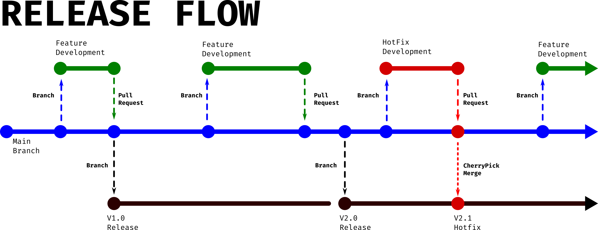
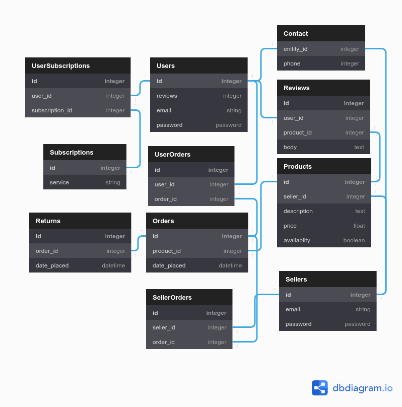

# *ACME Corporation is looking for devs with an understanding of Rails. The following set of questions relate to this RfQ-requirement.*---

### Q1 | Describe the architecture of a typical Rails application. (200-300)
Rails applications can be said to follow two architectural design patterns. These two design patterns are Monolithic application and MVC. A monolithic application as a oppose to a micro-services application is an app that is formed from one whole code base. It provides all of its functionality within itself. This differs form a micro-services style app where the app is formed by combining lots of little apps that work together to form a whole. While there is some debate on whether rails follows a true MVC pattern it is easy to say that it employs the principles of MVC heavily. MVC stands for Model, View, Controller; It is a pattern that splits up the large monolithic app into three related sub systems. The Model is responsible for manipulating the records within the applications database. This includes adding, editing or updating and removing them. The View takes information retrieved from the the model and renders it into a human accessible display. In rails this mainly takes the form of rendering the various web pages that are requested by a user. Finally the Controller is responsible for orchestrating the communication between the Model and the View. It is also the interface for the user. The user will request information, the Controller receives that request in the form of a route or HTTP request and then requests the information required from the model send it to the view to be rendered and then returns it to the user.
#### [Sources]---
1. [Advanced Ruby on Rails Architecture Way | Anastasiia Khmelovska](https://coaxsoft.com/blog/advanced-rails-architecture-way/)
2. [Episode #057 - Getting Started - Ruby on Rails - Architectural Overview | Driftiing Ruby](https://www.youtube.com/watch?v=9PAN-dvROl4)

### Q2 | Identify a database commonly used in web applications (including Rails) and discuss the pros and cons of this database (150-250)
###### PostgreSQL | Pros and Cons
When comparing the Pros and Cons of Postgres, it is useful to compare the database to other options out there. Postgres by default uses SQL to retrieve information from a relational database. A relational database is one with a strong schema meaning the data is organised into strict tables consisting of rows (the data entries) and columns (the types of information that makes up an entry) all information in a table will all be uniform. And more complicated information searches can be performed by "joining" related tables. This means that even if there is no information for a particular column for one row, the entry still has that column as part of its information. It makes it very easy to make sure that data retrieved from a relational database is going to match what your functions require as input. This differs from NoSQL databases or non relational databases. NoSQL databases forgo all the tables and forced uniformity of the data in favour of storing information information in collections of documents. These documents have a similar notation to that of a hash. The main difference here is that all documents are not forced to have the same keys. This leads to make a lot of operations performed on the database take less time as there are less checks and conventions to adhere to but means that you can't be certain of the properties being tracked by documents within a collection.
#### [Sources]---
1. [Comparison of PostgreSQL and MongoDB | Lorenz Stadler](https://www.youtube.com/watch?v=eM7hzKwvTq8)
2. [Pros and Cons of using PostgreSQL for Application Development | Stuti Dhruv](https://www.aalpha.net/blog/pros-and-cons-of-using-postgresql-for-application-development/)
3. [The Pros and Cons of 8 Popular Databases | Cody Arsenault](https://www.keycdn.com/blog/popular-databases#4-postgresql)

# *ACME Corporation is very big on project management, documentation and process. This will be a key metric in their decision to award the project. The following set of questions relate to this RfQ-requirement.*---

### Q3 | Discuss the implementation of Agile project management methodology (200-300)
Agile is just a project management style that helps to deliver products with changing end goals in a rapid and predictable pace. It achieves this by focusing on short term planing of achievable goals that bring the most value out of a given product. It is implemented by time boxing a (typically) two week period of time were a a development team will produce a working product that implements as many of the highest priority features as feasibly possible at the end of that period. The repeating that cycle with the next most important feature set again and again until the project is complete. It avoids the slowdowns of a traditional waterfall method by dedicating a core team of generalists that can work on many facets of the focused features at once. It also ensure the client gets exactly what they want even if what they want changes over the development cycle by closely involving the client, letting them determine what features bring the most value. Combining all this together results in a team that is more productive and delivers predictable value. This is because the people on the team are multi talented individuals that are all capable of working on any part of the project whilst producing a functional product every two weeks. Additionally as a client, you can see the product progress as you have a theoretically complete product every two and can decide to pivot or complete the project every short sprint.
#### [Sources]---
1. [Agile Foundations | Doug Rose](https://www.linkedin.com/learning/agile-foundations)
2. [Agile Project Management: Scrum & Sprint Demystified | Project Management Videos](https://www.youtube.com/watch?v=DvBKevrItcc)
3. [The Ultimate Guide to Implementing Agile Project Management (and Scrum) | Jory MacKay ](https://plan.io/blog/ultimate-guide-to-implementing-agile-project-management-and-scrum/)

### Q4 | Provide an overview and description of a standard source control workflow (100-200)
A source control flow is typically based around the release schedule of the software. One workflow that is popular is know as release workflow. This git work pattern is a trunk based git work flow. This means that branches that are created from the main branch are as short lived as possible before being merged back to main. This means that any amount of devs can branch out and develop code as need and cause less conflict on merge. When it comes time for a new release a branch is created from main and left as is, that code is used as the release. When the next release comes out the old release branch is discarded and a new one is created that is a copy of the main branch in its state at release. This doesn't make much sense, discarding the previous branch. what's the point? The final part of release flow is how hotfixes are handled. if there is a priority one bug found on the latest release, the fix for the bug is developed as a branch on main. when the fix is ready and merged back to main, that pull request is also then cherry picked for just the code that provides the fix and then merged to the current release. The benefit of this little bit of extra effort is that it ensures all bugs are fixed on main first meaning that those bugs won't appear again in the next release. if it were just worked on as a branch of the current release it could potentially lead to forgetting to fix the code in main and then the bug would appear a second time in the next release.

#### [Sources]---
1. [Professional Guides: Workflow Strategies | GitHub Training & Guides](https://www.youtube.com/watch?v=aJnFGMclhU8)
2. [The Workflow of Version Control | Git Tower](https://www.git-tower.com/learn/cheat-sheets/vcs-workflow)
3. [Comparing Workflows | Atlassian](https://www.atlassian.com/git/tutorials/comparing-workflows)

### Q5 | Provide an overview and description of a standard software testing process (e.g. manual testing) (100-200)
A software testing process is comprised of several phases: Plan, Create, Prepare, Execute, Result. Often referred to as a Software Testing Life Cycle (STLC). The planning phase involves analysing what is going to be tested, whether it is possible to test whatever aspect of the software you are investigating. What risks and cost are involved with the testing and finally what resources and materials will be required as part of the test.

The Create phase is about designing the test or tests. Generally this is about determining what inputs are thought to be possible to be input to the code and determining what the expected output should be to that input in relation to the requirements outlined in the planning phase.

The Prepare Phase is about setting up the right environment to be able to run the tests. This includes but is not limited to seeding data, setting up a run-time environment and ensuring the testing environment does an accurate job of simulating real life.

The Execute phase is self explanatory, it is the process of running the test planned and setup in the previous phases. Finally, the Results phase is about collecting the results of the tests and analysing the outcome. What passed? What failed? Why did those outcomes occur? What can be done to make the failing tests pass? These question should be answered as simply as possible in a report that can then be used in the next development cycle.
#### [Sources]---
1. [Software Testing Life Cycle (STLC) In Software Testing | Software Testing Material](https://www.youtube.com/watch?v=HylDB3bN6hQ)
2. [Software Testing Process and Levels of Testing | Miktad Öztürk](https://medium.com/swlh/software-testing-process-and-levels-of-testing-4274904ce655)
3. [What is Software Testing? | Ulf Eriksson](https://reqtest.com/testing-blog/the-a-to-z-guide-to-the-software-testing-process/)

# *Having suffered several cyber attacks in the past and resultant remedial audits ACME Corporation takes compliance, security and privacy very seriously. The following set of questions relate to this RfQ-requirement.*---

### Q6 | Discuss and analyse requirements related to information system security and how they relate to the project (100-200)
The requirements for Information security is commonly refered to as the CIA triad. The letters stand for **Confidentiality, Integrity** and **Accessibility**. Infosec is very important for a marketplace as everything in the triad can effect all users. For example, information pertaining to a individual user should be made confidential so that only the people that need to know have access. If a product of high value is being shipped you would want the world so see when it will arrive at the user's address as it might be stolen. Also you want integrity, you don't want the price to randomly change without the seller doing it themselves. Finally the data needs to be accessible so it can be updated, added to or removed by an authorised user at will. A customer might change address and need to update for example.

#### [Sources]---
1. [Information systems security | FIT Mostar](https://www.youtube.com/watch?v=8caqok3ah8o)
2. [An Introduction to Cyber Security Basics for Beginner | Shambhoo Kumar](https://geekflare.com/understanding-cybersecurity/)
3. [Introduction, Threat Models | MIT OpenCourseWare](https://www.youtube.com/watch?v=GqmQg-cszw4)

### Q7 | Discuss common methods of protecting information and data and how you would apply them to the project (100-200)
There are three parts to the CIA triad and different methods are employed to ensure information security is maintained. Access to data is very important but defining who can access it is even more so. By implementing Usernames and Passwords or other forms of *access control* you can prevent unauthorised access. Making sure data is properly deleted after it no longer required can also ensure the data does not fall privy to eyes that were not meant to see it. *Encryption* is another method for protecting data. by rendering the information unreadable to all but have the key to decrypt it. Making sure you have multiple *back ups* of data can ensure integrity and access if one were to be destroyed or stolen and there are services like Amazon S3 that ensure a 99.9999% uptime which is also a method of ensuring its security.

**Application to the project**\
Ruby on rails by default features encryption and user_access_tokens to verify a user. A Gem called Devise would be implemented to ensure access control with passwords and finally using Amazon S3 will ensure integrity for the data being stored.

#### [Sources]---
1. [6 Essential Data Protection Methods | GDPR Informer](https://gdprinformer.com/gdpr-articles/6-essential-data-protection-methods)
2. [Information systems security | FIT Mostar](https://www.youtube.com/watch?v=8caqok3ah8o)

### Q8 | Research what your legal obligations are in relation to handling user data and how they can be met for the project (100-200)
For the purpose of this question, it will be assumed that ACME Corp. does an annual turnover of more than $3 million dollars in Australia. Businesses that meet this criteria are subject to **The Privacy Act 1988**, this act is based on the 13 Australian Privacy Principles (APP). The APP describe how the responsible collection and use of privacy information is carried out. The general theme of the APP's are about transparency, accuracy, personal privacy protection and specifying what is and isn't acceptable when it come to both the methods of data collection and the situation in which it can be used for a business. Legal requirements can be met by ensure there is a clear, visible and understandable terms of service available to potential end users so they know what information is being collected and how/why it is being collected. And by ensure the project complies with the APP's.
#### [Sources]---
1. [Privacy Law in Australia | Go To Court Lawyers](https://www.youtube.com/watch?v=MQc-UjE560A)
2. [Privacy and data protection | How to engage in cyber policy](https://www.youtube.com/watch?v=ZNEPaGFApX4)
3. [Data protection and privacy in Australia | McCullough Robertson](https://www.lexology.com/library/detail.aspx?g=7598b614-4431-4429-9897-c83e40682865#:~:text=There%20is%20no%20such%20requirement,which%20the%20information%20was%20collected.)
4. [Australian Privacy Principles | Australian Government](https://www.oaic.gov.au/privacy/australian-privacy-principles/)

# *ACME Corporation has specifically requested the app to be based on a relational database. The next set of questions relate to this RfQ-requirement.*---

### Q9 | Describe the structural aspects of the relational database model. Your description should include information about the structure in which data is stored and how relations are represented in that structure. (100-200)
There are two mains aspects to the structure of relational databases, Tables and Keys. In a relational database all information is stored on tables. They feature columns, these are the pieces of information an entry conveys. A table will also have rows, these are the individual data entries. Each table will always have a column that can be used to uniquely each row. This is known as a primary key, most commonly it takes the form of an incremental integer called an id. The primary key can then be used by referencing in in other tables. When a column references a primary key in another table it is called a foreign key. This is useful as it indicates the data belongs to or is related to some entry in another table. Complex information can be easily conveyed this way by *"joining"* tables. This is achieved by beginning a new table and assigning a primary key and then referencing the primary keys of two other tables. This is done because it allows tables to be specific and eliminates data that isn't necessary to define what the table is tracking. For example, a customers shipping address is not going to be effected by his purchase history. So a customers shipping address and purchase orders are likely to be two different tables and related by foreign keys in a joining table.
#### [Sources]---
1. [Relational Database Concepts | Prescott Computer Guy](https://www.youtube.com/watch?v=NvrpuBAMddw)
2. [What a Relational Database Is | Oracle Australia](https://www.oracle.com/au/database/what-is-a-relational-database/)
3. [Introduction to Relational Database Structure and Terminology | RelationalDBDesign](https://www.relationaldbdesign.com/database-design/module2/intro-relational-database-structure.php)

### Q10 | Describe the integrity aspects of the relational database model. Your description should include information about the types of data integrity and how they can be enforced in a relational database. (100-200)
There are three main forms of integrity that are enforced by a relational database. Entity integrity, Referential Integrity and Domain Integrity. All the forms of Integrity are enforced by imposing specific constraints on your data to ensure data is usable inside your database.

Entity integrity is about ensuring uniqueness of your data. It creates redundancy and double handling if the same data was to be duplicated. This means that no two tables should have the same name and within a table, all tuples must be able to be uniquely identified. This means if you have top update data, you don't have to look in more than one place and you don't have to update it more than once.

Referential integrity is about making the relationships in your database stay consistent. this includes things like making sure no attribute is left with a nil or null value and that foreign keys cannot be deleted without deleting the data they point to. This ensures your database remains clean and that there is no malformed data. Having broken links or empty values in your data sets can lead to logic breaking expectantly.

Finally, Domain integrity is about controlling the type of data stored in an attribute so that you can be sure how you can use it when retrieving it. this is implemented by restricting attributes to be of certain data type.
#### [Sources]---
1. [Database Design 7 - Data Integrity | Caleb Curry](https://www.youtube.com/watch?v=1D_h-yFtQVo)
2. [What is Data Integrity and Why Is It Important? | talend](https://www.talend.com/resources/what-is-data-integrity/)
3. [Enforcing data integrity in databases | Sybase Inc.](http://infocenter.sybase.com/help/index.jsp?topic=/com.sybase.infocenter.dc32300.1570/html/sqlug/sqlug300.htm)

### Q11 | Describe the manipulative aspects of the relational database model. Your description should include information about the ways in which data is manipulated (added, removed, changed, and retrieved) in a relational database. (100-200)
The language used to interact with a relational database is called SQL or Structured Query Language. There a few parts to the language, but the part that concerns the manipulation of the data within the database is plainly called Data Manipulation Language, or DML. DML consists of several functions, four common functions are **SELECT, INSERT, UPDATE** and **DELETE**. Select lets you retrieve and display information from the database. Insert allows you to add entirely new information. Update allows for the editing of information already within the database. Finally, Delete allows for the the removal of no longer required records.

#### [Sources]---
1. [Lesson: Relational Database Basics | Webucator](https://www.webucator.com/tutorial/learn-sql/relational-database-basics.cfm)
2. [Structured Query Language: Manipulating Databases Using SQL | Study.com](https://study.com/academy/lesson/structured-query-language-manipulating-databases-using-sql.html)
3. [Everything you need to know about (Relational) Databases | Lucas Olivera](https://dev.to/lmolivera/everything-you-need-to-know-about-relational-databases-3ejl)

# *The efficiency of an app (i.e. site) and the algorithms used are of the utmost importance. The next set of questions relate to this RfQ-requirement.*---

### Q12 | Identify and explain the workings of TWO sorting algorithms and discuss and compare their performance/efficiency (i.e. Big O) (300-500)
###### Bubble Sort ---
The bubble sort algorithm for sorting gets its name from the way the largest elements look like that bubble up to the end of the list. It sorts a list by looking at the first two adjacent elements and comparing them. if the second item is less than the first, their positions in the list are swapped. Then the next two items undergo the same procedure. This is repeated until the algorithm reaches the end of the list. At this stage, the largest element in the list will be correctly sorted. The algorithm then repeats the entire process again and again until it makes a pass over the entire list without having to make any swaps, at which point the list is sorted.

This is a simple method that works the downside is that the more elements in a target list the longer it will take to make each pass over the list, addition more passes will need to be made over a longer list. This leads to a time complexity relationship of **O(n^2)** meaning the actions required to sort them is equal to the number of items squared actions. This is pretty terrible, the advantage the algorithm has however is that the items are sorted in place and no extra memory is required to sort the list.

###### Merge Sort---
Merge sort is known as a divide and conquer algorithm. it works by calling it self recursively to first break down a large array into smaller and smaller new sub arrays until each sub array contains one item. then the original array is built back up again by comparing the the first elements of two sub arrays and placing them in order into a sorted sub array. This phase is repeated until all elements of the broken down sub arrays are "merged" together in order and the process repeats back up the sub arrays until the final sorted sub array has all the original elements in it and and is sorted.

By halving the array over and over again, the algorithm doesn't have to compare each element to every other element as in Bubble sort. this drastically improves the efficiency by reduces the time complexity to **O(nLog(n))**. The relative difference in efficiency become more and more apparent with longer lists. The draw back to the algorithm however is that as it generates more arrays to then sort them, the algorithm requires more memory to hold the sub arrays. this is a space complexity of **O(n)** meaning that to sort a list that takes up **n** amount of memory a further **n** amount of space will be required to hold the sub arrays as the list is being sorted. This is a decent trade of however as computer memory is is easy to expand and time is hard to get back.

#### [Sources]---
1. [3 Levels of Sorting Algorithms - FASTEST Comparison Sort! | Kite](https://www.youtube.com/watch?v=qk7b4-iyCJ4)
2. [Sorting Algorithms: The Difference Between Bubble Sort and Merge Sort | AnnMargaret Tutu](https://medium.com/@codeAMT/sorting-algorithms-the-difference-between-bubble-sort-and-merge-sort-bc91c3c2aff1)
3. [Bubble & Merge Sort Algorithms | MrBrownCS](https://www.youtube.com/watch?v=EM3YC3dtMv8)

### Q13 | 	Identify and explain the workings of TWO search algorithms and discuss and compare their performance/efficiency (i.e. Big O) (300-500)
###### Linear Search---
Linear search is a simple algorithm that brute forces it's way through a list to find a specific item. It works by taking the list your searching and looking at each element in turn and comparing it to your target. If it matches return it, otherwise look at the next item. if the item is the last in the list and it isn't equal to the target, return -1. In the best case, the target is found at the beginning of the list **O(1)**, at worst it will take **n** comparisons **O(n)**. On average linear search has a complexity **n(n+1)/2n** but at large numbers of **n** coefficients quickly become insignificant and this simplifies to a Big O of **O(n)**. This is where linear search gets it's name, its linear time complexity.

###### Binary Search---
Binary search can only be performed on sorted lists, the algorithm executes thusly. It splits the array into two halves by selecting the middle value. it compares the middle to its target. If the middle is greater than the target than the top half of the array is discarded. Conversely if the middle is smaller than the target the top half is excluded. then the halving begins again with the remaining sub section of the array. This recurs until there is one remaining value. if that value is equal to the target it is returned, otherwise a value of -1 is returned. In best, worst and average cases Binary search performs with a Big O of **O(Log n)** this is because it doesn't check for equivalence to the target until there is one value. So the halving of the array doesn't stop event if the middle of the array it selects is equal to the target. The algorithm see a best case improvement for time complexity if it were to check the middle value against the target every time but it slows it down on average because it has to perform twice as many comparisons.

###### The Difference---
Binary search is far quicker, this easy to see just by thinking about it. If linear search doesn't find the target on the first comparison it still has every other element in the list to check. With binary search, it excludes half of the remain possible locations for the target every time it makes a comparison which is where it derives its **O(Log n)** time complexity. the draw back of binary search is that the data set must be sorted before hand.

#### [Sources]---
1. [Binary Search Big-O Analysis | musicAlgo](https://www.youtube.com/watch?v=OIQgJU-Xt3Q)
2. [Algorithms Lesson 5: Linear and Binary Searching | xoaxdotnet](https://www.youtube.com/watch?v=wNVCJj642n4)
3. [Linear Search Vs Binary Search | Promila Ghosh Monty](https://hackernoon.com/linear-search-vs-binary-search-ce7c56f8feb1)
4. [Linear Search vs Binary Search  GeeksforGeeks](https://www.geeksforgeeks.org/linear-search-vs-binary-search/)

# *Companies (including ACME Corporation) value previous project experience and case studies. The following set of questions relate to this RfQ-requirement.*---

### Q14 | Conduct research into a marketplace website (_**Amazon**_) and answer the following parts:

##### a. List and describe the software used by _**Amazon**_. (50-100)
A company the size of Amazon uses a variety of technologies to power it's online presence. From front end techs like the Angular framework to back end things like JAVA for back end. Software like MySQL and DynamoDB is utilised for data storage. Amazon offers a whole bunch of tools for developers and most certainly other tools are being used. AWS for hosting the website, perhaps Docker for testing.

##### b. Describe the hardware used to host _**Amazon**_. (50-100)
It will be almost a certainty that Amazon will be using a distributed network. Server banks in many locations around the world to reduce local customers load time. This know as cloud hosting, numerous physical servers in numerous location power a virtual machine that handles all the requests made to the website. This differs from single server hosting where a single machine powers the entire site. The benefits gained from the more complicated cloud set up include reliability and scalability. If one machine is taken offline, the others can take up the slack, need more processing power? Add another machine to your cloud to handle the load.

##### c. Describe the interaction of technologies within _**Amazon**_. (50-100)
Front end techs like HTML, CSS and Javascript along with various frameworks like Angular are utilised to display information is an easy to understand and aesthetic manner so customer can interact with it. MySQL and DynamoDB are used to store information about customers and there requests. and finally it is tied all together with back end technologies like web frameworks GWT which is written with JAVA to control all the activity on the site.

##### d. Describe the way data is structured within _**Amazon**_. (50-100)
Data is most likely to be structured in a relational database. This means data will held in various tables related to specific entities using or being displayed on the site. An identifying key will be used to keep track of the attributes associated with it and then the keys from different tables can be linked to other tables to show relationships between data sets.

##### e. Identify entities which must be tracked by _**Amazon**_. (50-100)
- **Users**: Entities who use the website to purchase products or subscriptions.
- **Sellers**: Entities who use the website to sell products.
- **Contact**: Tracks the contact details for entities
- **Products**: Information about items being sold.
- **Reviews**: Reviews posted by Users about Products
- **Subscriptions**: Information about subscriptions offered and who is signed up.
- **Orders**: Shipping and payment information about Items Purchased.
- **Returns**: Shipping information and details about who/why a product was returned.

##### f. Identify the relationships and associations between the entities you have identified in part (e). (50-100)

---**Users**---
- has many Orders
- has one set of contact details
- has many Reviews
- has many subscriptions

---**Sellers**---
- has one set of contact details
- has many Orders
- has many products

---**Products**---
- belongs to a Seller
- has many Reviews
- belongs to many Orders

---**Orders**---
- has many Products
- belongs to a User
- has one seller
- has one return

---**Subscriptions**---
- belongs to a user

---**Reviews**---
- belongs to a user
- belongs to a product

---**Returns**---
- belongs to an order

---**Contact**---
- belongs to a user or seller

##### g. Design a schema using an Entity Relationship Diagram (ERD) appropriate for the database of _**Amazon**_ (assuming a relational database model). (50-100)
[Click here for Daniel's ERD design for Amazon](https://dbdiagram.io/d/5f050b050425da461f04612b)

**NOTE!** The relationships might be hard to see in the picture but if you click on the link *above* and got to the ERD online you can hover over tables or individual relationship lines to see the relation ship. dbdiagram.io use the 1 and * to denote 'one' and 'many', with many to many relations shown with the use of a joining table that is two, one-many relations.

#### [Sources]---
1. [Amazon | Stackshare](https://stackshare.io/amazon/amazon)
2. [What is the technology stack used by Amazon? | Quora](https://www.quora.com/What-is-the-technology-stack-used-by-Amazon)
3. [What is Cloud Hosting and how does it work? | MARTIN AUSTWICK](https://www.wirehive.com/thoughts/cloud-hosting-work/)
4. [17 Popular Java Frameworks (2019 edition): Pros, cons, and more | Anna Monus](https://raygun.com/blog/popular-java-frameworks/)
